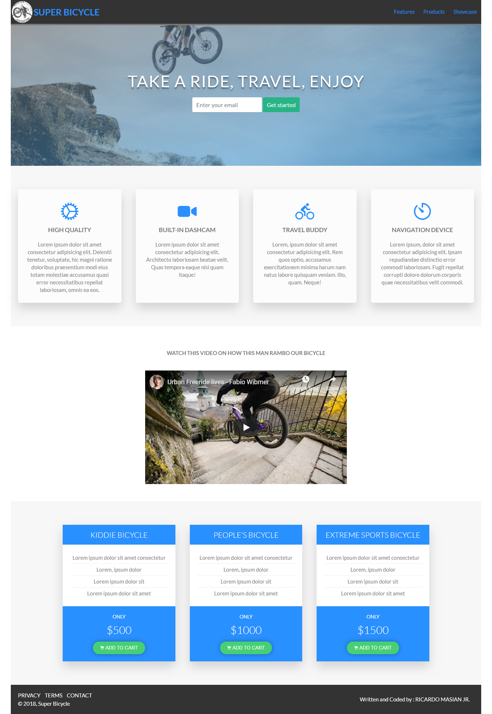

# fcc-product-landing-page

Build a Product Landing Page. This is the third project of [FreeCodeCamp Responsive Web Design Certification](https://learn.freecodecamp.org/responsive-web-design/responsive-web-design-projects/build-a-product-landing-page).

A landing page for a fictional bicycle shop which is _Super Bicycle_. To showcase their products to the customers.

## Live Demonstration

Live project link: <https://codepen.io/rmasianjr/full/vQpQEN/>

## Screenshot

## Objective

- [x] Build a CodePen.io app that is functionally similar to this: <https://codepen.io/freeCodeCamp/full/RKRbwL>. Fulfill the below user stories and get all of the tests to pass. Give it your own personal style. You can use HTML, JavaScript, and CSS to complete this project. Plain CSS is recommended because that is what the lessons have covered so far and you should get some practice with plain CSS. You can use Bootstrap or SASS if you choose. Additional technologies (just for example jQuery, React, Angular, or Vue) are not recommended for this project, and using them is at your own risk. Other projects will give you a chance to work with different technology stacks like React. We will accept and try to fix all issue reports that use the suggested technology stack for this project. Happy coding!

## User Stories

- [x] My product landing page should have a header element with a corresponding `id="header"`.
- [x] I can see an image within the `header` element with a corresponding `id="header-img"`. A company logo would make a good image here.
- [x] Within the `#header` element I can see a nav element with a corresponding `id="nav-bar"`.
- [x] I can see at least three clickable elements inside the `nav` element, each with the class `nav-link`.
- [x] When I click a `.nav-link` button in the `nav` element, I am taken to the corresponding section of the landing page.
- [x] I can watch an embedded product video with `id="video"`.
- [x] My landing page has a `form` element with a corresponding `id="form"`.
- [x] Within the form, there is an `input` field with `id="email"` where I can enter an email address.
- [x] The `#email` input field should have placeholder text to let the user know what the field is for.
- [x] The `#email` input field uses HTML5 validation to confirm that the entered text is an email address.
- [x] Within the form, there is a submit `input` with a corresponding `id="submit"`.
- [x] When I click the `#submit` element, the email is submitted to a static page (use this mock URL: <https://www.freecodecamp.com/email-submit>) that confirms the email address was entered and that it posted successfully.
- [x] The navbar should always be at the top of the viewport.
- [x] My product landing page should have at least one media query.
- [x] My product landing page should utilize CSS flexbox at least once.
